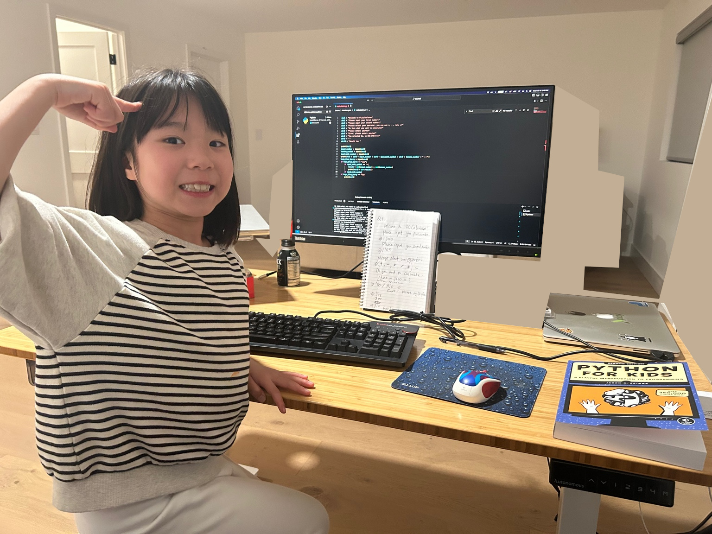

# My Python Learning Journey

## First Day Coding - Feb. 28, 2024

Started on February 28, 2024

## Overview
This repository contains my journey of learning Python programming. Here you'll find various projects and exercises that demonstrate my progress in different areas of Python programming.

## Project Structure
- `algorithms/` - Sorting, searching, and other algorithm implementations
  - Bubble Sort, Merge Sort
  - Two Sum solutions
  - Search algorithms

- `graphics/` - Tkinter and drawing related files
  - Basic animations
  - Shape drawing
  - Interactive graphics

- `oop/` - Object-Oriented Programming examples
  - Class implementations
  - Bank account simulation

- `games/` - Game development projects
  - Bounce game
  - Game assets (sounds, images)

- `basics/` - Basic Python concepts
  - Fibonacci implementations
  - Palindrome checker
  - Basic arithmetic

- `assets/` - Images and sound files
  - Game assets
  - Project images

- `img/` - Documentation images
  - Learning journey photos

## Getting Started
To run any of the Python files in this repository, you'll need:
- Python 3.x installed
- Required dependencies (if any) mentioned in the specific project files

## Progress
This is a living repository that will be updated as I continue my Python learning journey. New projects and improvements will be added regularly.

